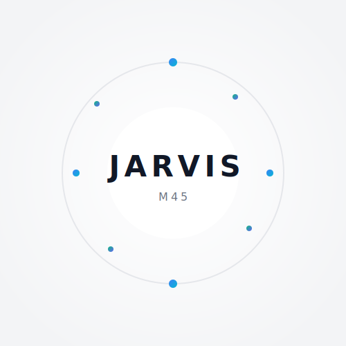

#  Jarvis M45

### The Ultimate Cross-Platform AI Voice Assistant

**Jarvis M45** is a real-time AI voice assistant that hears, sees, understands, and controls your computer. Built on Google Gemini 2.5 Flash for live bidirectional audio, it executes complex tasks across **Windows, macOS, and Linux** through natural conversation — no rigid command syntax required.

---

##  What Makes Jarvis M45 Different

Jarvis M45 doesn't just follow scripts. It **understands intent**. Say things naturally:

| You Say | Jarvis Does |
|---------|------------|
| *"Exit Spotify"* / *"Close Spotify"* / *"Kill that music app"* | Closes Spotify |
| *"What's eating my RAM?"* / *"Show running processes"* | Runs system diagnostics |
| *"Open Chrome"* / *"Launch browser"* / *"Can you start Firefox?"* | Opens the right app |
| *"Make it louder"* / *"I can't hear"* / *"Volume up"* | Adjusts system volume |
| *"Turn off WiFi"* / *"Go offline"* / *"Disconnect network"* | Toggles WiFi |
| *"What's on my screen?"* / *"Look at this"* | Captures & analyzes screen |

---

##  Capabilities

| Category | Features |
|----------|----------|
|  **Voice** | Real-time bidirectional audio, any language, ultra-low latency |
|  **System Control** | Launch/close apps, volume, brightness, WiFi, dark mode, lock, restart, keyboard shortcuts |
|  **System Diagnostics** | Disk space, memory, CPU, processes, network, services, logs, packages, temperature, battery, firewall, SSH, Docker, Git — on all 3 OSes |
|  **AI Learning** | Learns from every interaction — remembers preferences, adapts behavior, improves over time |
|  **Deep Exploration** | Searches entire filesystem, analyzes processes, explores installed apps, finds files by name or content |
|  **Vision** | Real-time screen capture & analysis, webcam access |
|  **Web** | Smart search with deep research, browser automation (Playwright), content extraction, social media capture |
|  **Files** | Process PDF, Word, Excel, CSV, JSON, images, audio, video, code, archives, presentations |
|  **Typing** | Type text, press keys, run shell commands |
|  **Messaging** | Send WhatsApp/Telegram/Discord messages |
|  **Reminders** | Set timed reminders with notifications |
|  **Travel** | Flight search & tracking |
|  **Gaming** | Steam & Epic game updates/management |
|  **YouTube** | Search, play, download, get transcripts & summaries |
|  **Dev Tools** | Code generation, explanation, execution, project scaffolding |

---

##  Quick Start

```bash
git clone https://github.com/Lintshiwe/Jarvis-M45.git
cd Jarvis-M45
python setup.py          # Installs dependencies + Playwright browsers
python main.py           # On first launch, enter your Gemini API key
```

**No API key is bundled** — you'll enter your own free key from [Google AI Studio](https://aistudio.google.com) on first run.

---

##  Build Standalone Executable

Build a single-file app for distribution:

```bash
# Linux
bash build_tools/build.sh        # → dist/JARVIS-M45

# macOS
bash build_tools/build.command   # → dist/JARVIS-M45.app

# Windows
build_tools\build.bat            # → dist\JARVIS-M45.exe
```

Pre-built binaries are available in the [Releases](https://github.com/Lintshiwe/Jarvis-M45/releases) section.

---

##  How It Works

```
Your Voice → Gemini Live API → Tool Selection → Action Execution
                ↓
          Intent Interpretation (AI analyzes meaning, not keywords)
                ↓
          Learning System (remembers what worked, improves next time)
```

1. **Intent Layer** — Jarvis uses AI to interpret what you mean, regardless of how you phrase it
2. **Tool Dispatch** — Selects the right tool (open_app, web_search, computer_settings, system, etc.)
3. **Execution** — Runs the action natively on your OS (Windows/macOS/Linux detection built-in)
4. **Learning** — Records interactions, adapts to preferences, builds a personalized knowledge base

---

##  Architecture

```
Jarvis-M45/
├── main.py                 # Entry point, live audio, tool dispatch
├── ui.py                   # PyQt6 GUI with setup overlay, system metrics
├── core/
│   └── prompt.txt          # Personality, intent rules, speech style
├── actions/                # 18 tool modules
│   ├── system_command.py   # Shell execution + 20 OS diagnostics
│   ├── computer_settings.py # Volume, brightness, windows, WiFi, etc.
│   ├── open_app.py         # App launcher (8-layer Linux, Windows, macOS)
│   ├── web_search.py       # DuckDuckGo + deep research + URL extraction
│   ├── browser_control.py  # Playwright automation
│   ├── file_controller.py  # File ops with safety sandbox
│   ├── file_processor.py   # PDF, image, code, audio, video processing
│   ├── screen_processor.py # Screen capture & analysis
│   ├── system_learning.py  # Learning & adaptation engine
│   └── ...                 # send_message, reminder, youtube, flights, etc.
├── agent/                  # Planning & execution subsystem
│   ├── planner.py          # Multi-step goal decomposition
│   ├── executor.py         # Task execution with error recovery
│   └── error_handler.py    # Smart error analysis & fix generation
├── memory/                 # Persistent user memory (JSON)
├── config/                 # API keys (user-provided, not bundled)
└── build_tools/            # PyInstaller specs + build scripts
```

---

##  Requirements

| Requirement | Details |
|-------------|---------|
| **OS** | Windows 10/11, macOS 12+, Linux (Wayland/X11) |
| **Python** | 3.10 – 3.12 |
| **Microphone** | Required for voice |
| **API Key** | Free Gemini API key from [Google AI Studio](https://aistudio.google.com) |

---

##  Safety

- **No API key bundled** — you provide your own
- **Dangerous commands** (restart, shutdown, sudo) require explicit confirmation
- **File sandbox** — restricted to user directories, system paths blocked
- **Command safety** — forbidden patterns checked before execution
- **Anti-hallucination** — Jarvis only acts when explicitly commanded

---

##  Creator

**Lintshiwe Ntoampi**

---

##  License

This project is released into the public domain. Do whatever you want with it.
